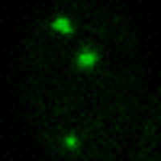
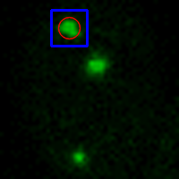
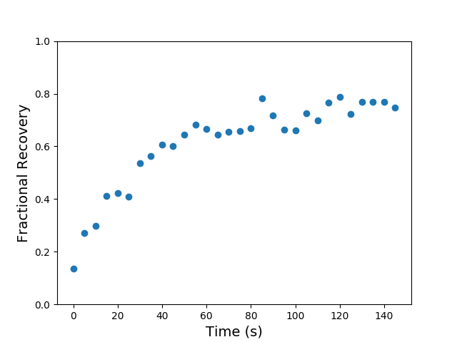

# Track Fluorescent Protein in Live Cell

Fluorescence Recovery After Photobleaching (FRAP) is a widely used experiment to study protein dynamics
in Biophysics. 
A tiny area of the cell is bleached by the laser at time zero, and the following fluorescence recovery is recorded.

Traditionally, people use software like ImageJ to manually quantify the intensity of a specific region. It would be
a huge pain when a large sample size is needed. In addition, the manual selection of target regions often involves
subjective bias which may cause inconsistency of the results.
Here, I developed a simple solution to track the target protein (puncta/aggregate) in the live cell and automatically
quantify the mean intensity. 

This approach can also be readily adapted for other live cell imaging applications.
 
For more statistical analysis and scientific plotting of the data, refer to my 
[`frapplot`](https://github.com/GuanqiaoDing/frapplot) repository or download the R package from 
[CRAN](https://cran.r-project.org/web/packages/frapplot/index.html).
 